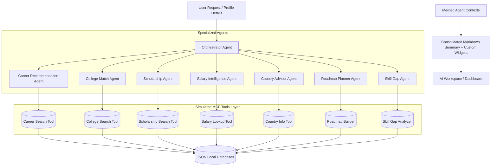

# CareerPathFinder AI 🧭

> "Discover Your Future. Powered by AI."

CareerPathFinder AI is a state-of-the-art, full-stack AI-powered Career Operating System designed to help students and professionals worldwide map their future pathways. Similar to "Google Maps for Careers", the platform takes input parameters (enjoyed academic subjects, familiar skills, targets, budgets, and preferred visa pathways) and orchestrates a **Multi-Agent AI Counseling System** powered by Claude API (claude-sonnet-4-20250514) to return structured recommendations, break-even tuition analyses, and detailed career blueprints.

---

## 🚀 Key Features (14 Interactive Pages)

1. **Landing Page (Public)**: Responsive promotional hub with mesh gradients, features grid, trust strips, FAQ accordions, and customer testimonials.
2. **Dashboard (AI Command Center)**: Unified command dashboard showing career confidence indices, sparkline charts, dynamic recommendations lists, and progress checkpoints.
3. **Career Discovery**: Duolingo-style onboarding wizard consisting of 12 profiling steps (work styles, budget constraints, skills, target countries) updating the profile in real time.
4. **AI Workspace**: Perplexity-style counseling chat interface which parses responses into structured widgets (charts, timelines, university cards) instead of long text segments.
5. **Career Comparison Matrix**: Add and compare up to 5 careers side-by-side across starting packages, stress indices, and automation risks.
6. **Career Roadmap Timeline**: Track interactive milestones (Class 11 -> Intermediate -> Articleship stipend -> CFO) with course suggestions and duration estimates.
7. **Career Universe Map**: Interactive zoomable SVG mind map node network showing links between auditing compliance, investment banking, and fintech entrepreneurship.
8. **Skill Gap Analysis**: Gauge competencies relative to target fields, listing certification options filterable by platform providers (Coursera, Udemy, NPTEL).
9. **Salary Explorer**: Line chart salary projections, global cost matrices, and an interactive break-even tuition ROI Calculator.
10. **College Finder**: Airbnb-style listings displaying placement percentiles, hostel options, rankings, and transport proximity markers (airports, subways).
11. **Scholarship Explorer**: AI probability calculator checking eligibility constraints against family income caps and grades metrics.
12. **Country Advisor**: Review work permits, visa difficulty ratings, and permanent residency (PR) odds.
13. **AI Career Report**: Print-friendly blueprint cover and action item checklist with PDF exports.
14. **Settings & Customizations**: Edit profile parameters, choose AI personality style (Detailed, Concise, Balanced), and download backups.

---

## 🤖 Multi-Agent & MCP Architecture Diagram



---

## 🛠 Directory Structure

```
/google ptroject
  /client             - React SPA Frontend
    /src
      /components     - Sidebar, TopNav, FloatingAssistant, GlassCard
      /context        - AppContext (Student profile, theme, chat states)
      /pages          - 14 full page components
      /styles         - index.css (custom tailwind, glassmorphism templates)
      main.tsx
      App.tsx
    tailwind.config.js
    vite.config.ts
    package.json
  /server             - Express API Backend
    /agents           - multiAgentSystem (Orchestrator and Sub-agent logic)
    /data             - JSON datasets (careers, colleges, scholarships, countries, salaries)
    /tools            - mcpTools (Simulated MCP search and calculation scripts)
    server.js         - API Endpoints
    package.json
  README.md
```

---

## 💻 Installation & Local Setup

### Prerequisites
- Node.js (v18+)
- npm

### 1. Backend Setup
1. Navigate to `/server` and install dependencies:
   ```bash
   cd server
   npm install
   ```
2. Create a `.env` file in the `/server` folder:
   ```env
   PORT=5000
   CLAUDE_API_KEY=your-claude-api-key-here
   ```
   *Note: If no API key is specified, the server automatically and gracefully falls back to a high-fidelity local database matching simulation, ensuring 100% functionality.*

3. Start the development server:
   ```bash
   npm run dev
   ```

### 2. Frontend Setup
1. Navigate to `/client` and install dependencies:
   ```bash
   cd ../client
   npm install
   ```
2. Start the Vite development server:
   ```bash
   npm run dev
   ```
3. Open your browser and navigate to `http://localhost:3000` to start exploring.

---

## 🛡 Security & Deployability
- **Sanitized Inputs**: All user forms (discovery wizard, calculator variables) are validated in the controllers.
- **Environment Safety**: Credentials like the Anthropic API keys are loaded via server-side environment configurations (`.env`) and never exposed to client-side files.
- **Graceful Fallbacks**: If connection failures occur with external LLM pipelines, specialized local agents resolve queries locally using relational indices.
- **Production Builds**: Built with TypeScript compilation guidelines (`tsc && vite build`) for deployment on Vercel, Netlify, or AWS Amplify.

---

## 🌐 Production Deployment & Redeployment

### Step-by-Step Hosting Instructions

This app is configured to be deployed with **Vercel** (for frontend) and **Render** (for backend):

1. **Push to GitHub**:
   Push the files to a new GitHub repository on your account.
2. **Deploy Backend (Render)**:
   - Create a new **Web Service** pointing to your repository.
   - Set **Root Directory** to `server`.
   - Set **Build Command** to `npm install` and **Start Command** to `npm start`.
   - Add environment variables:
     - `CLAUDE_API_KEY`: Your Anthropic API Key.
     - `FRONTEND_URL`: Your Vercel frontend URL (e.g., `https://your-app.vercel.app`).
3. **Deploy Frontend (Vercel)**:
   - Import your repository.
   - Set **Root Directory** to `client`.
   - Add environment variable:
     - `VITE_API_URL`: Your Render backend URL (e.g., `https://your-backend.onrender.com`).
4. **Link CORS**: Update the `FRONTEND_URL` environment variable on Render to match your Vercel domain.

### 🔄 How to Redeploy Future Code Changes

Both Vercel and Render are integrated directly with Git for **Continuous Deployment**. When you make code modifications:

1. Commit and push your changes to the `main` branch of your GitHub repository:
   ```bash
   git add .
   git commit -m "Describe your update"
   git push origin main
   ```
2. Render and Vercel will automatically detect the new commit, build the updated code in the background, and redeploy the live website with zero downtime.

### 💻 Local Development Remains Intact
Running local development retains the exact same workflow as before. The proxy configurations are preserved:
- Simply run `npm run dev` at the root folder to boot both services locally at once.

